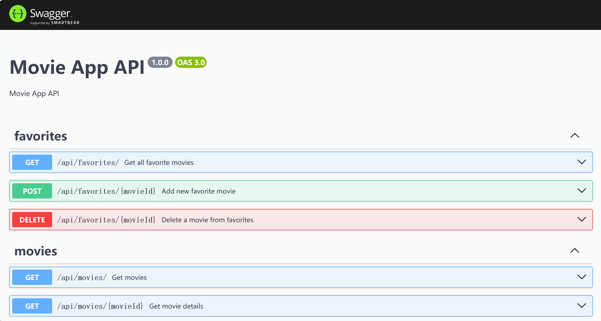

# Assignment 2 - Web API.

Name: Yiwei Liu

## Features.
 
 + Users can reset password
 + Improved validation of username
 + Error message is displayed when login, signup or reset
 + Users can view user profile
 + New MongoDB collections: favorites, reviews
 + Users can add a movie to favorites
 + Users can remove a movie from favorites
 + Users can create reviews

## Setup requirements.

Start Swagger:

After starting backend app in `localhost:8080`, go to `localhost:8080/swagger` to see Swagger API document.

## API Configuration
______________________
NODEENV=development
PORT=8080
HOST=localhost
MONGO_DB=YourMongoURL
TMDB_KEY=YourTMDBKey
SECRET=YourJWTSecret
______________________

## API Design

- /api/movies?page={page} | GET | Gets a list of movies 
- /api/movies/{movieid} | GET | Gets a single movie
- /api/movies/upcoming/list?page={page} | GET | Gets a list of upcoming movies 
- /api/movies/genres/list | GET | Gets a list of  movie genres 
- /api/movies/{movieId}/credits | GET | Gets all credits of a movie
- /api/movies/actor/{actorId} | GET | Gets a single actor
- /api/movies/actor/{actorId}/movie_credits | GET | Gets acted movies of an actor
- /api/movies/{movieId}/similar | GET | Gets similar movies of a movie
- /api/movies/trending/{timeWindow} | GET | Gets trending movies by time window (day or week)
- /api/movies/search/{keyword} | GET | Gets movies by searching keyword
- /api/movies/{movieId}/images | GET | Gets images of a movie
- /api/movies/actor/{actorId}/images | GET | Gets images of an actor

- /api/users | GET | Gets all users
- /api/users/{username} | GET | Gets a user by username
- /api/users?action=register | POST | Creates new user
- /api/users | POST | Authenticates user
- /api/users/{useId} | PUT | Updates user (resets password)

- /api/favorites | GET | Gets all favorite movies of current user
- /api/favorites/{movieId} | POST | Add a movie to favorite movies of current user
- /api/favorites/{movieId} | DELETE | Deletes a movie from favorite movies of current user

- /api/reviews/{movieId}/mongodb | GET | Gets reviews of a movie from MongoDB
- /api/reviews/{movieId}/tmdb | GET | Gets reviews of a movie from TMDB
- /api/reviews/{movieId} | POST | Creates new review of a movie, stores in MongoDB

Swagger: `localhost:8080/swagger/`

## Security and Authentication

Give details of authentication/security implemented on the API (e.g. passport/sessions). Indicate which routes are protected.

Authentication and security:

+ Use bcrypt to encrypt user password
+ Use JWT as authentication token

Routes:

+ Protected:
    + /movies/favorites
    + /movies/:id
    + /actors/:id
    + /search/:keyword
    + /reviews/:id
    + /reviews/form

+ Public:
    + /
    + /movies/upcoming
    + /movies/trending/:timeWindow"
    + /login
    + /signup
    + /reset
    + /user

## Integrating with React App

Every fetch from frontend app sends request to Web API.

In Web API, I use TMDB API to get Movies data, but Users, Favorites and Reviews are from MongoDB.

List the views that use my Web API instead of the TMDB API:

+ Every.

## Independent learning (if relevant)

Briefly explain any non-standard features developed for the app.

+ Use Swagger to create documentation for APIs
    + References: 
        + https://juejin.cn/post/7157246112699514887
        + https://editor.swagger.io/
